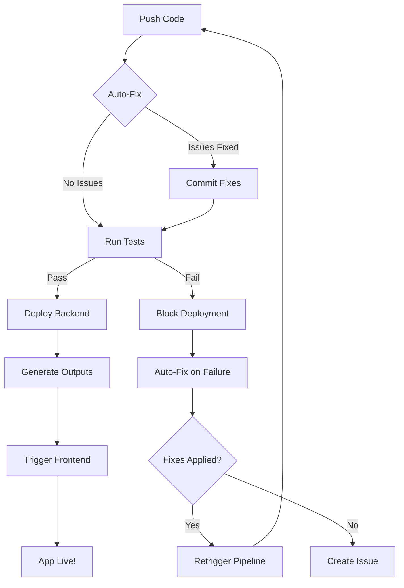

# 📚 Complete Usage Guide for Amplify Pipeline MCP

## Table of Contents
1. [Quick Start](#quick-start)
2. [Core Features](#core-features)
3. [Auto-Fix System](#auto-fix-system)
4. [Performance Features](#performance-features)
5. [Testing Integration](#testing-integration)
6. [Notifications](#notifications)
7. [Advanced Features](#advanced-features)
8. [Troubleshooting](#troubleshooting)

---

## Quick Start

### Basic Pipeline Setup

The simplest way to set up your pipeline with Claude Code:

```
You: "Set up pipeline for my amplify app"
Claude: "I'll help you set up the pipeline. What's your app ID?"
You: "di441fw7gu9yh"
Claude: [Automatically runs pipeline_deploy and sets everything up]
```

Or in one command:
```
You: "pipeline deploy di441fw7gu9yh"
```

### What Gets Created Automatically

When you run the basic command, you get:

1. **Main GitHub Actions Workflow** with:
   - ✅ Auto-fix for linting and formatting
   - ✅ Build caching (30-50% faster)
   - ✅ Automatic dependency installation
   - ✅ Backend deployment
   - ✅ Frontend triggering
   - ✅ Error recovery

2. **Auto-Fix Script** (`scripts/auto-fix.js`):
   - Fixes ESLint issues
   - Fixes Prettier formatting
   - Resolves TypeScript errors
   - Handles missing dependencies
   - Fixes Amplify configuration

3. **Auto-Fix on Failure Workflow**:
   - Triggers when builds fail
   - Attempts comprehensive fixes
   - Retriggers pipeline automatically

---

## Core Features

### 1. Basic Deployment

After initial setup, your workflow is:

```bash
git add .
git commit -m "Add new feature"
git push
```

That's it! The pipeline:
1. Auto-fixes any linting/formatting issues
2. Deploys backend
3. Generates amplify_outputs.json
4. Triggers frontend build
5. Your app is live!

### 2. Skip Deployment

Sometimes you want to push without deploying:

```bash
git commit -m "Update docs [skip ci]"
```

### 3. Skip Auto-Fix

To push code without auto-fixing:

```bash
git commit -m "Experimental changes [skip-fix]"
```

---

## Auto-Fix System

### How It Works

The auto-fix system runs in two stages:

#### Stage 1: Pre-Deployment (Always runs)
- Fixes linting issues
- Fixes formatting
- Commits fixes if needed
- Continues with deployment

#### Stage 2: On Failure (Only if build fails)
- Analyzes failure reason
- Runs comprehensive fixes
- Commits and retriggers

### Manual Auto-Fix

Run auto-fix locally before pushing:

```bash
node scripts/auto-fix.js
```

### Customizing Auto-Fix

Edit `scripts/auto-fix.js` to add custom fixes:

```javascript
// Add your custom fix
fixMyCustomIssue() {
  this.log('Fixing custom issue...', 'fix');
  // Your fix logic here
  this.exec('npm run my-custom-fix', true);
  this.fixes.push('Fixed custom issue');
}

// Add to run() method
async run() {
  // ... existing fixes
  this.fixMyCustomIssue();
}
```

### Common Issues Auto-Fixed

| Issue | Auto-Fix Action | When |
|-------|----------------|------|
| Unused variables | Remove with ESLint | Before deploy |
| Wrong quotes | Fix with Prettier | Before deploy |
| Missing semicolons | Add with ESLint | Before deploy |
| Import order | Sort with ESLint | Before deploy |
| Missing types | Add with TypeScript | On failure |
| Security vulnerabilities | npm audit fix | On failure |
| Missing amplify_outputs.json | Generate from app ID | On failure |

---

## Performance Features

### Enable Build Caching

Build caching is **enabled by default**. It caches:
- Node modules
- NPM cache
- Next.js build cache

Result: **30-50% faster builds**

### Add Bundle Size Checking

With Claude Code:
```
You: "Add bundle size checking to my pipeline"
```

Or manually:
```bash
cd your-project
./scripts/add-features.sh performance
```

This adds:
- Bundle size limits (configurable)
- Size reporting in GitHub
- Build failure if over limit

### Configure Performance Budgets

Edit in your workflow:

```yaml
env:
  MAX_BUNDLE_SIZE_MB: 10  # Adjust as needed
  MAX_JS_SIZE_KB: 500
  MAX_CSS_SIZE_KB: 100
```

---

## Testing Integration

### Add Test Runner

With Claude Code:
```
You: "Add testing to my pipeline"
```

Or manually:
```bash
./scripts/add-features.sh test
```

### What Gets Added

1. **Test execution before deployment**
2. **Coverage reports**
3. **PR comments with coverage**
4. **Test failure blocks deployment**

### Configure Test Thresholds

Add to `package.json`:

```json
{
  "jest": {
    "coverageThreshold": {
      "global": {
        "branches": 80,
        "functions": 80,
        "lines": 80,
        "statements": 80
      }
    }
  }
}
```

### Running Tests Locally

```bash
npm test                    # Run tests
npm test -- --coverage      # With coverage
npm test -- --watch         # Watch mode
```

---

## Notifications

### Setup Slack Notifications

1. **Get Slack Webhook URL**:
   - Go to https://api.slack.com/apps
   - Create app → Incoming Webhooks → Add New Webhook

2. **Add to GitHub Secrets**:
   - Repository → Settings → Secrets → Actions
   - Add `SLACK_WEBHOOK_URL`

3. **Enable in Pipeline**:
   ```bash
   ./scripts/add-features.sh notifications
   ```

### Setup Discord Notifications

1. **Get Discord Webhook**:
   - Server Settings → Integrations → Webhooks → New Webhook

2. **Add to GitHub Secrets**:
   - Add `DISCORD_WEBHOOK_URL`

### Custom Notifications

Create custom notifications in your workflow:

```yaml
- name: Custom Notification
  if: always()
  run: |
    curl -X POST "${{ secrets.CUSTOM_WEBHOOK }}" \
      -H "Content-Type: application/json" \
      -d '{
        "status": "${{ job.status }}",
        "branch": "${{ github.ref_name }}",
        "message": "${{ github.event.head_commit.message }}"
      }'
```

---

## Advanced Features

### Multi-Environment Setup

Deploy to different environments:

```yaml
# .github/workflows/deploy-staging.yml
on:
  push:
    branches: [develop]

env:
  ENVIRONMENT: staging
  APP_ID: your-staging-app-id
```

### Parallel Testing

Run tests in parallel for faster results:

```yaml
strategy:
  matrix:
    test-suite: [unit, integration, e2e]
    
steps:
  - run: npm run test:${{ matrix.test-suite }}
```

### Security Scanning

Add security checks:

```bash
./scripts/add-features.sh security
```

This adds:
- npm audit on every push
- Git secrets scanning
- Dependency vulnerability checks

### Rollback Capability

Quick rollback when things go wrong:

```bash
# Rollback to previous commit
git revert HEAD
git push

# Or restore previous amplify_outputs.json
git checkout HEAD~1 -- amplify_outputs.json
git commit -m "Rollback to previous backend"
git push
```

### PR Preview Environments

For pull requests, add this workflow:

```yaml
# .github/workflows/pr-preview.yml
on:
  pull_request:
    types: [opened, synchronize]

jobs:
  preview:
    runs-on: ubuntu-latest
    steps:
      - uses: actions/checkout@v3
      - name: Deploy Preview
        run: |
          npx ampx sandbox --branch pr-${{ github.event.number }}
      - name: Comment PR
        uses: actions/github-script@v6
        with:
          script: |
            github.rest.issues.createComment({
              issue_number: context.issue.number,
              owner: context.repo.owner,
              repo: context.repo.repo,
              body: '🔗 Preview: https://pr-${{ github.event.number }}.app.com'
            })
```

---

## Using with Claude Code

### Natural Language Commands

Claude understands these requests:

```
"Set up my pipeline"
"Add testing to the pipeline"
"Enable Slack notifications"
"Add bundle size checking"
"Fix the failing build"
"Why did my deployment fail?"
"Add security scanning"
"Make builds faster"
```

### Checking Pipeline Status

Ask Claude:
```
"Check my pipeline status"
"Show recent deployments"
"Why is the build failing?"
"Show me the workflow logs"
```

### Debugging with Claude

```
"The build is failing with TypeScript errors"
Claude: [Automatically runs auto-fix and explains the solution]

"Bundle size is too large"
Claude: [Analyzes bundle and suggests optimizations]

"Tests are failing"
Claude: [Reviews test output and helps fix issues]
```

---

## Configuration Files

### GitHub Secrets Required

| Secret | Purpose | Required |
|--------|---------|----------|
| `AWS_ACCESS_KEY_ID` | AWS deployment | ✅ Yes |
| `AWS_SECRET_ACCESS_KEY` | AWS deployment | ✅ Yes |
| `SLACK_WEBHOOK_URL` | Slack notifications | ❌ Optional |
| `DISCORD_WEBHOOK_URL` | Discord notifications | ❌ Optional |
| `NOTIFICATION_EMAIL` | Email alerts | ❌ Optional |

### Environment Variables

Set in your workflow:

```yaml
env:
  # Performance
  MAX_BUNDLE_SIZE_MB: 10
  ENABLE_CACHE: true
  
  # Testing
  MIN_COVERAGE: 80
  RUN_E2E_TESTS: false
  
  # Notifications
  NOTIFY_ON_SUCCESS: false
  NOTIFY_ON_FAILURE: true
  
  # Auto-fix
  AUTO_FIX_ENABLED: true
  AUTO_FIX_COMMIT: true
```

---

## Troubleshooting

### Common Issues and Solutions

#### 1. Auto-Fix Creates Too Many Commits

**Solution**: Disable auto-commit in CI:
```yaml
env:
  AUTO_FIX_COMMIT: false
```

#### 2. Build Fails Even After Auto-Fix

**Check**:
1. Look at the auto-fix workflow logs
2. Some issues can't be auto-fixed (logic errors, failed tests)
3. Manual intervention needed

#### 3. Notifications Not Working

**Check**:
1. Webhook URL is correct in GitHub Secrets
2. No typos in secret names
3. Webhook service is active

#### 4. Cache Not Working

**Solution**: Clear cache in GitHub:
1. Go to Actions → Caches
2. Delete old caches
3. Re-run workflow

#### 5. Pipeline Runs Too Slowly

**Optimize**:
1. Ensure caching is enabled
2. Run jobs in parallel
3. Skip unnecessary steps
4. Use `paths-ignore` for docs

### Getting Help with Claude

Ask Claude for help:
```
"My pipeline is failing"
"How do I add feature X?"
"Optimize my build time"
"Debug this error: [paste error]"
```

---

## Best Practices

### 1. Commit Message Conventions

```bash
feat: Add new feature
fix: Fix bug
docs: Update documentation
test: Add tests
perf: Improve performance
ci: Update pipeline
```

### 2. Branch Strategy

- `main` → Production
- `develop` → Staging
- `feature/*` → Development
- `hotfix/*` → Emergency fixes

### 3. Security

- Never commit secrets
- Use GitHub Secrets for sensitive data
- Enable security scanning
- Regular dependency updates

### 4. Performance

- Keep bundle size under 10MB
- Lazy load large components
- Use caching effectively
- Monitor build times

### 5. Testing

- Write tests for new features
- Maintain >80% coverage
- Run tests before deployment
- Use preview environments for PRs

---

## Quick Reference

### Essential Commands

```bash
# Setup
pipeline deploy <app-id>

# Add features
./scripts/add-features.sh all

# Run auto-fix
node scripts/auto-fix.js

# Skip deployment
git commit -m "message [skip ci]"

# Skip auto-fix
git commit -m "message [skip-fix]"
```

### File Structure

```
your-project/
├── .github/
│   └── workflows/
│       ├── amplify-pipeline-main.yml      # Main pipeline
│       └── auto-fix-on-failure.yml        # Auto-fix on failure
├── scripts/
│   ├── auto-fix.js                        # Auto-fix script
│   └── add-features.sh                    # Feature installer
├── amplify/
│   └── ...                                # Amplify backend
└── amplify_outputs.json                   # Generated config
```

### Pipeline Flow



---

## Support

For issues or questions:

1. **Ask Claude Code**: "Help with pipeline error"
2. **Check Logs**: GitHub Actions → Your Workflow → Job Logs
3. **Review Guide**: This document
4. **Check AWS Console**: Amplify Console for frontend logs

Remember: The pipeline is designed to be self-healing. Most issues will be auto-fixed!