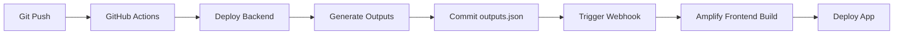

# AWS Amplify Custom Pipeline MCP Server

A Model Context Protocol (MCP) server that automates the setup of custom CI/CD pipelines for AWS Amplify Gen 2 applications with a single command.

> 📚 **[Complete Usage Guide](./COMPLETE_USAGE_GUIDE.md)** - Comprehensive guide for all features
> 🚀 **[Feature Roadmap](./FEATURE_ROADMAP.md)** - Upcoming features and enhancements
> 🤖 **[Auto-Fix Documentation](./AUTO_FIX_FEATURES.md)** - Deep dive into auto-fix system

## Overview

This MCP server simplifies the process of setting up custom pipelines for Amplify Gen 2 apps, where backend deployment is handled by GitHub Actions and frontend builds are triggered via webhooks. With just one command - `pipeline-deploy` - everything is configured automatically, including **comprehensive auto-fix capabilities** that automatically resolve common deployment errors.

## The New Workflow

### Step 1: Manual Setup (One Time)
1. Create your Amplify app in AWS Console
2. Connect your GitHub repository using the AWS Amplify GitHub App
3. This establishes the secure connection between Amplify and GitHub

### Step 2: Automated Pipeline Setup
From your repository directory, just say:
- **"pipeline deploy"** or
- **"set up pipeline"** or  
- **"p-deploy"**

That's it! The MCP server handles everything else automatically.

## What Happens Automatically

When you run `pipeline-deploy` with your app ID, the server:
- ✅ Uses the provided app ID
- ✅ Auto-detects your current Git branch
- ✅ Disables auto-build for the branch
- ✅ Creates a webhook for frontend deployments
- ✅ Generates GitHub Actions workflow with **auto-fix capabilities**
- ✅ Creates **auto-fix script** to handle deployment errors
- ✅ Sets up **auto-fix on failure workflow** for automatic recovery
- ✅ Creates proper `amplify.yml` build specification
- ✅ Saves app ID for future use in the workflow

### 🤖 NEW: Auto-Fix System
The pipeline now includes an intelligent auto-fix system that:
- **Automatically fixes** linting and formatting issues before deployment
- **Detects and resolves** TypeScript errors when possible
- **Patches security vulnerabilities** with `npm audit fix`
- **Handles missing dependencies** and import errors
- **Fixes Amplify configuration issues** including missing `amplify_outputs.json`
- **Retries failed builds** after applying fixes
- **Commits fixes automatically** with clear messages

## Prerequisites

1. **AWS CLI** configured with appropriate credentials
2. **AWS Amplify GitHub App** installed for your organization
3. **Amplify app** created and connected to your GitHub repository
4. **Python 3.9+** installed
5. **MCP-compatible client** (like Claude Code)

## Installation

1. Install dependencies:
```bash
pip install mcp pyyaml
```

2. Create a shell script wrapper (`run_server.sh`):
```bash
#!/bin/bash
cd /path/to/amplify-pipeline-mcp
python server.py
```

3. Make it executable:
```bash
chmod +x run_server.sh
```

4. Add to your Claude configuration:
```bash
claude mcp add amplify-pipeline /path/to/amplify-pipeline-mcp/run_server.sh
```

## Usage

### With Claude Code (Natural Language)

```
"Set up pipeline for my amplify app"
"Add testing to my pipeline"
"Enable Slack notifications"
"Why is my build failing?"
```

### Direct Command

```
"pipeline deploy d1234abcd5678"
```

### Adding Features

```bash
# Add specific features
./scripts/add-features.sh test           # Add test runner
./scripts/add-features.sh notifications  # Add Slack/Discord
./scripts/add-features.sh performance    # Add performance monitoring
./scripts/add-features.sh all           # Add everything
```

The app ID can be found in your Amplify Console URL:
- Go to AWS Amplify Console
- Click on your app
- The URL will be: `.../apps/d1234abcd5678/...`
- Copy the ID: `d1234abcd5678`

The MCP server will:
- Use your provided app ID
- Auto-detect your current Git branch  
- Set up the complete custom pipeline
- Generate all necessary files
- Provide clear next steps

## How It Works



### Pipeline Architecture

1. **Backend Deployment**: GitHub Actions handles backend deployment using `npx ampx pipeline-deploy`
2. **Configuration Bridge**: `amplify_outputs.json` is generated and committed to the repository
3. **Frontend Build**: Amplify Console builds the frontend using the committed configuration
4. **Webhook Trigger**: Frontend builds are triggered via webhook after backend deployment

## What Gets Created

### 1. GitHub Actions Workflow (`.github/workflows/amplify-pipeline-{branch}.yml`)
- Triggers on push to your branch
- **Auto-fixes linting and formatting issues** before deployment
- Deploys backend using `npx ampx pipeline-deploy`
- Generates and commits `amplify_outputs.json`
- Triggers frontend build via webhook
- **Includes write permissions** for auto-fix commits

### 2. Auto-Fix Script (`scripts/auto-fix.js`)
- Comprehensive Node.js script for fixing common issues
- Handles ESLint, Prettier, TypeScript, and Amplify errors
- Can be run manually or automatically by workflows
- Smart detection of fixable vs non-fixable issues

### 3. Auto-Fix on Failure Workflow (`.github/workflows/auto-fix-on-failure.yml`)
- **Triggers automatically** when main pipeline fails
- Runs comprehensive auto-fix script
- Commits fixes and retriggers pipeline
- Prevents infinite loops with smart detection

### 4. Build Specification (`amplify.yml`)
- Configured for frontend-only builds
- Uses the committed `amplify_outputs.json`
- Optimized for Next.js applications

### 5. Webhook Configuration
- Created automatically for triggering frontend builds
- URL saved and included in GitHub Actions workflow

## Required GitHub Setup

After running `pipeline-deploy`, you need to:

1. **Add GitHub Secrets**:
   - `AWS_ACCESS_KEY_ID` - AWS access key for deployments
   - `AWS_SECRET_ACCESS_KEY` - AWS secret key for deployments

2. **Ensure Repository Permissions**:
   - GitHub Actions needs write permissions (added automatically to workflow)
   - Verify `amplify_outputs.json` is NOT in `.gitignore`

3. **Commit and Push**:
```bash
git add -A
git commit -m "Add custom pipeline configuration"
git push
```

## Auto-Fix Features

### What Gets Fixed Automatically

| Issue Type | Auto-Fix Action | When Applied |
|------------|----------------|---------------|
| Linting errors | ESLint --fix | Before deployment |
| Formatting | Prettier --write | Before deployment |
| TypeScript errors | Add missing types/imports | On failure |
| Security vulnerabilities | npm audit fix | On failure |
| Missing dependencies | npm install | On failure |
| Missing amplify_outputs.json | Generate from app ID | On failure |
| Import path issues | Fix relative imports | Before deployment |

### Customizing Auto-Fix

After initial setup, you can customize the auto-fix behavior:

1. **Edit `scripts/auto-fix.js`** to add custom fixes
2. **Modify workflows** to change when fixes are applied
3. **Add `[skip-fix]`** to commit messages to skip auto-fix

For detailed auto-fix documentation, see [AUTO_FIX_FEATURES.md](./AUTO_FIX_FEATURES.md)

## Troubleshooting

### App ID Not Detected
- Ensure your repository is connected to Amplify via AWS Console
- Check you're in the correct repository directory
- Verify the GitHub App has access to your repository

### Pipeline Deploy Fails
- Confirm AWS CLI is configured with correct credentials
- Verify the Amplify app exists and is connected to GitHub
- Check that you have necessary IAM permissions

### Frontend Build Fails
- Verify repository is properly connected in Amplify Console
- Check webhook URL is correct in the workflow
- Ensure `amplify_outputs.json` is committed to repository

## Benefits

- **Full Control**: Complete control over build and deployment process
- **Custom Steps**: Add testing, linting, security scans, etc.
- **Integration**: Works with existing CI/CD systems
- **Optimization**: Optimize build times and caching strategies
- **Multi-Environment**: Easy to set up different pipelines for different environments
- **🤖 Auto-Fix**: Automatically resolves common deployment errors
- **Zero Downtime**: Fixes are applied without manual intervention
- **Learning Tool**: Review auto-fix commits to learn from mistakes
- **Time Saving**: No more fixing trivial linting/formatting issues

## Example Workflow

After setup, your deployment flow will be:

1. 📝 Make code changes locally
2. 📤 Push to GitHub branch
3. 🔄 GitHub Actions triggers automatically
4. 🔧 **Auto-fix runs** (fixes linting, formatting, etc.)
5. 🏗️ Backend deploys via `ampx pipeline-deploy`
6. 📋 `amplify_outputs.json` generated and committed
7. 🎨 Frontend build triggered via webhook
8. ✅ App is live with latest changes

### If Build Fails:
1. ❌ Build fails for any reason
2. 🤖 **Auto-fix workflow triggers**
3. 🔧 Applies comprehensive fixes
4. 📤 Commits fixes automatically
5. 🔄 Pipeline retriggers with fixes
6. ✅ Build succeeds

## Quick Feature Reference

### 🎯 Core Features (Automatic)
- ✅ **Auto-Fix System** - Fixes linting, formatting, TypeScript errors automatically
- ✅ **Build Caching** - 30-50% faster builds with intelligent caching
- ✅ **Error Recovery** - Self-healing pipeline that retries after fixing issues
- ✅ **Concurrency Control** - Prevents conflicting deployments

### 🔧 Optional Add-ons
- 🧪 **Testing** - Unit tests, coverage reports, PR comments
- 🔔 **Notifications** - Slack, Discord, Email alerts
- 📊 **Performance** - Bundle size limits, Lighthouse CI
- 🔐 **Security** - Vulnerability scanning, secret detection

### 📁 Template Library
```
templates/
├── test-runner.yml        # Testing configuration
├── notifications.yml      # Alert systems
└── performance-checks.yml # Performance monitoring
```

## Documentation

- 📚 **[Complete Usage Guide](./COMPLETE_USAGE_GUIDE.md)** - Step-by-step instructions for all features
- 🤖 **[Auto-Fix Features](./AUTO_FIX_FEATURES.md)** - How the self-healing system works
- 🚀 **[Feature Roadmap](./FEATURE_ROADMAP.md)** - What's coming next
- 💡 **[Examples](./examples/)** - Sample configurations and use cases

## Support

### With Claude Code
Simply ask:
- "Help with pipeline setup"
- "Debug my failing build"
- "Add feature X to pipeline"
- "Optimize build performance"

### Manual Support
- Check the [Complete Usage Guide](./COMPLETE_USAGE_GUIDE.md)
- Review workflow logs in GitHub Actions
- Check AWS Amplify Console for frontend logs
- Ensure all prerequisites are met

## Development

### Setting Up for Development

1. **Install with auto-reload for development:**
```bash
# Install nodemon for auto-reload
npm install -g nodemon

# Add MCP server in development mode
claude mcp add amplify-pipeline-dev "nodemon --exec python /Users/kjetilge/mcp-servers/amplify-pipeline-mcp/server.py"
```

2. **Make changes to `server.py`** - it will auto-reload

3. **Test your changes:**
```bash
cd /path/to/test/amplify/project
claude
# Test the tools
```

### Project Structure

```
amplify-pipeline-mcp/
├── server.py           # Main MCP server implementation
├── README.md          # User documentation
├── .claude            # Development context for Claude
├── example-usage.md   # Detailed usage examples
└── pyproject.toml     # Python package configuration
```

### Adding New Features

When adding new features:
1. Read `.claude` file for project context
2. Add new tool in `list_tools()`
3. Implement logic in `AmplifyPipelineManager`
4. Update `call_tool()` to handle new tool
5. Test with real Amplify apps
6. Update README and examples

### Testing Checklist

- [ ] Test with new Amplify app
- [ ] Test with existing Amplify app
- [ ] Test auto-detection (app ID, branch)
- [ ] Test with different branch names
- [ ] Verify webhook creation
- [ ] Confirm GitHub Actions workflow runs
- [ ] Check error handling for missing credentials

### Common Development Commands

```bash
# List installed MCP servers
claude mcp list

# Remove old version
claude mcp remove amplify-pipeline-dev

# Reinstall after major changes
claude mcp add amplify-pipeline-dev "nodemon --exec python /path/to/server.py"

# Check AWS CLI configuration
aws configure list
aws amplify list-apps --region eu-north-1

# Test webhook manually
curl -X POST 'webhook-url-here'
```

### Debugging Tips

1. **Enable logging:** Add more `logger.info()` calls
2. **Check generated files:** Look for `.amplify-webhook-*.json` files
3. **Verify AWS state:** Use AWS CLI to check branch settings
4. **Test commands manually:** Run AWS CLI commands directly
5. **Check GitHub Actions:** Look at workflow run logs

### Contributing

Feel free to enhance this MCP server! Key areas for improvement:
- Support for more CI/CD platforms
- Better error recovery
- Enhanced auto-detection
- Pipeline monitoring tools
- Cost optimization features

## License

MIT