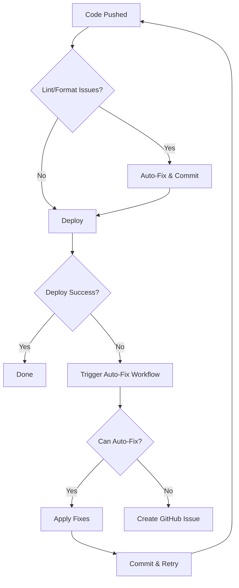

# Example: Auto-Fix Scenarios

## How Auto-Fix Handles Common Issues

### Scenario 1: Forgot to Format Code

**You push:**
```javascript
const myFunction=(param1,param2)=>{
return param1+param2}
```

**Auto-fix converts to:**
```javascript
const myFunction = (param1, param2) => {
  return param1 + param2;
};
```

**Result:** ✅ Code formatted and deployed

---

### Scenario 2: ESLint Errors

**You push:**
```javascript
import React from 'react';  // Unused import
const data = [1, 2, 3];
console.log("test");  // Console.log left in

function processData() {
    return data.map(item => item * 2)  // Missing semicolon
}
```

**Auto-fix converts to:**
```javascript
const data = [1, 2, 3];
// console.log("test");  // Commented out

function processData() {
    return data.map(item => item * 2);
}
```

**Result:** ✅ Cleaned up and deployed

---

### Scenario 3: TypeScript Errors

**You push:**
```typescript
function processUser(user) {  // Missing type
  return user.name.toUpperCase()
}

const result: any = getData();  // Using 'any'
```

**Auto-fix attempts:**
```typescript
function processUser(user: unknown) {  // Added type
  if (typeof user === 'object' && user && 'name' in user) {
    return (user as {name: string}).name.toUpperCase();
  }
}

const result: unknown = getData();  // Replaced 'any'
```

**Result:** ✅ Types fixed where possible

---

### Scenario 4: Missing Dependencies

**Build fails with:**
```
Error: Cannot find module 'lodash'
```

**Auto-fix runs:**
```bash
npm install lodash
git add package.json package-lock.json
git commit -m "🤖 Auto-fix: Added missing dependency"
```

**Result:** ✅ Dependency installed and pipeline retries

---

### Scenario 5: Missing amplify_outputs.json

**Build fails with:**
```
Error: amplify_outputs.json not found
```

**Auto-fix runs:**
```bash
npx ampx generate outputs \
  --app-id d1234abcd5678 \
  --branch main \
  --format json
  
git add amplify_outputs.json
git commit -m "🤖 Auto-fix: Generated amplify_outputs.json"
```

**Result:** ✅ Configuration generated and pipeline continues

---

## Customizing Auto-Fix Behavior

### Add Your Own Fixes

Edit `scripts/auto-fix.js`:

```javascript
class AutoFixer {
  // ... existing code

  // Add custom fix for your specific issue
  fixCustomIssue() {
    this.log('Checking for custom issue...', 'fix');
    
    // Example: Fix import paths
    const files = this.exec('find . -name "*.tsx" -o -name "*.ts"', true);
    if (files) {
      files.split('\n').filter(f => f).forEach(file => {
        let content = fs.readFileSync(file, 'utf8');
        
        // Replace relative imports with aliases
        content = content.replace(/from ['"]\.\.\/\.\.\//g, "from '@/");
        
        fs.writeFileSync(file, content);
      });
      
      this.fixes.push('Fixed import paths');
    }
  }

  async run() {
    // ... existing fixes
    this.fixCustomIssue();  // Add your fix to the run sequence
  }
}
```

### Disable Specific Fixes

To skip certain auto-fixes:

```javascript
async run() {
  this.fixLinting();
  this.fixFormatting();
  // this.fixVulnerabilities();  // Commented out - skip this
  this.fixTypeScriptErrors();
}
```

### Configure Fix Aggressiveness

```javascript
// Conservative - only safe fixes
const FIX_LEVEL = 'safe';

// Aggressive - attempt all fixes
const FIX_LEVEL = 'aggressive';

fixTypeScriptErrors() {
  if (FIX_LEVEL === 'aggressive') {
    // More aggressive fixes
    content = content.replace(/: any/g, ': unknown');
  } else {
    // Only safe fixes
    this.exec('npx eslint . --fix --rule "no-unused-vars: error"');
  }
}
```

## When Auto-Fix Can't Help

### Scenario: Logic Errors

**Your code:**
```javascript
function calculateTotal(items) {
  return items.reduce((sum, item) => sum - item.price, 0);  // Wrong operator
}
```

**Auto-fix:** ❌ Cannot fix (logic error)
**Solution:** Manual fix required

### Scenario: Failed Tests

**Test failure:**
```
Expected: "Hello World"
Received: "Hello Wrold"
```

**Auto-fix:** ❌ Cannot fix (test logic)
**Solution:** Fix the typo manually

### Scenario: API Key Issues

**Error:**
```
Error: Invalid API key
```

**Auto-fix:** ❌ Cannot fix (credentials issue)
**Solution:** Update secrets in GitHub

## Auto-Fix Workflow



## Best Practices

### 1. Review Auto-Fix Commits

Always review commits made by auto-fix:
```bash
git log --grep="🤖 Auto-fix"
```

### 2. Test Auto-Fix Locally

Before pushing:
```bash
node scripts/auto-fix.js
```

### 3. Skip Auto-Fix When Needed

For experimental code:
```bash
git commit -m "Experimental changes [skip-fix]"
```

### 4. Monitor Auto-Fix Patterns

If auto-fix frequently fixes the same issues:
1. Update your local development setup
2. Add pre-commit hooks
3. Configure your IDE

## Troubleshooting Auto-Fix

### Too Many Fix Commits

**Problem:** Auto-fix creates multiple commits
**Solution:** 
```yaml
env:
  MAX_AUTO_FIX_ATTEMPTS: 1
```

### Auto-Fix Loop

**Problem:** Fix → Deploy → Fail → Fix (infinite loop)
**Solution:** Auto-fix uses `[skip ci]` to prevent loops

### Auto-Fix Not Running

**Check:**
1. Workflow has `contents: write` permission
2. Script exists at `scripts/auto-fix.js`
3. Node.js version is 18+
4. Check workflow logs for errors